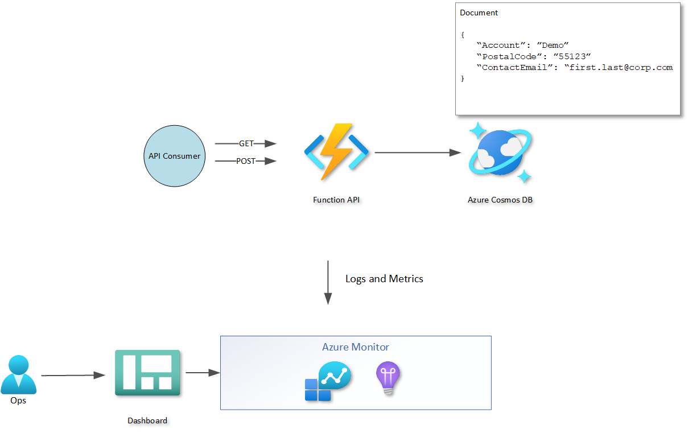

# demo-az-function-cosmos-db

Reference implementation for serverless API hosted with an Azure Function and a CosmosDB backend.

## Key Components

### CICD

#### Infrastructure as Code

ARM templates are located in the Infrstructure folder and used in the release pipeline. 

#### Build

**azure-build-pipelines.yml** - contains the build pipeline which build the function app code (.Net) and creates app and infrstructure pipeline artifacts. 

#### Release

**azure-release-pipelines.yml** - contains the release pipeline that triggers on completion of the build pipeline. This pipeline leverages the azure-release-pipelines-stage-template.yml template to deploy each stage.

### Solution

